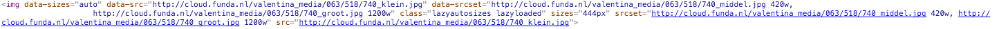
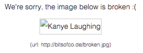
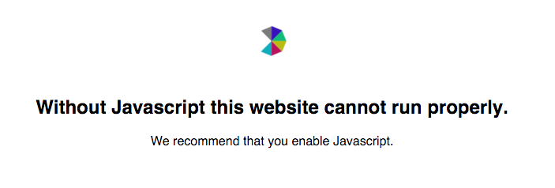

# Funda

**Opdracht:** Bestudeer 12 features die het web kunnen breken en bedenk/verricht oplossingen die dit zouden op kunnen vangen. Hieronder Mijn bevindingen voor het vak Browser Technlogies.

## Progressive Enhancement

### 1. Afbeeldingen
------------------------

**Probleem**

Funda’s is een grote site met veel content. En nog meer plaatjes. Gelukkig gebruikt optimaliseert Funda zelf alle afbeeldingen al in verschillende resoluties en sizes (2x etc.). Deze staan ook in de API die we hebben gekregen om te gebruik voor onze app. Verder is het belangrijk om alt titles te hebben op je  tags, als vervanging voor als het plaatje niet laadt.

**Oplossing**

Een oplossing hiervoor is het picture element met srcset gebruiken en de plaatjes responsive aanbieden in verschillende formaten. Verder een alt tags toevoegen op alle images die je hebt met een juiste beschrijving. Je kunt deze ook nog stylen met door met psuedo classes een alternatief te geven en het plaatje aan te bieden via een andere link die het wel doet.

**Links:** http://bitsofco.de/styling-broken-images/

### ~~2. Custom Fonts (nvt)~~

### 3. Javascript (volledig)
------------------------

**Probleem**

Zonder javascript werkt de Funda app niet, omdat de core draait op javascript. Het is natuurlijk het mooist om een oplossing te bieden voor mensen die geen javascript aan hebben. Dit ook omdat websites die gemaakt zijn voor organisaties of instanties zoals de gemeente of de overheid verplichte eisen hebben, omdat je de wet kan overtreden vanwege discriminatie.

**Oplossing**

Een oplossing hiervoor is de applicatie ombouwen en content niet genereren door middel van javascript, maar statische html pagina’s. Een andere oplossing is te kijken naar feature detection met Modernizr. Zo kun je fallbacks maken voor bijvoorbeeld history states. Mijn tijdelijke oplossing hiervoor is een <noscript> toevoegen aan mijn Funda app, waarin ik de eindgebruiker aanraad om Javascript aan te zetten bij gebruik. Dit is niet de oplossing waar je naartoe wil, maar zo los ik het momenteel op.

**Links:** https://css-tricks.com/rethinking-dynamic-page-replacing-content/

### 4. Kleur

**Probleem**

Kleur speelt een grote rol op de functionaliteit en het design van een website. Je kunt er veel mee nuanceren. Maar het wordt lastiger als je bezoekers op je website hebt die kleuren niet (goed) kunnen zien. Daarom moet je als ontwerper rekening houden met deze doelgroep.

**Oplossing**

Kleur speelt een grote rol op de functionaliteit en het design van een website. Je kunt er veel mee nuanceren. Maar het wordt lastiger als je bezoekers op je website hebt die kleuren niet (goed) kunnen zien. Daarom moet je als ontwerper rekening houden met deze doelgroep.

[Kleur voor](12features/Kleur/color_before.png) [Kleur na](12features/Kleur/color_after.png)

### 5. Breedband internet
------------------------

**Probleem**

Niet iedereen heeft glazvezel internet en zo gaat dus niet voor iedereen alles even snel tijdens het surfen op het web. Op performancegebied kun je ver komen om het voor iedereen toegankelijk te maken.

**Oplossing**

Wat ik zelf heb toegepast in mijn applicatie is het gebruiken van kleinere images, en het verkleinen van bestanden door middel van gulp. In mijn geval verbeter ik de performance door scripts en css bestanden te verkleinen. Een oplossing om de afbeeldingen van Funda kleiner te maken zou een imageOptim plugin kunnen zijn van gulp.

### ~~6. Cookies (nvt)~~

### ~~7. Javascript deels - Wifi hotspots/HTTPS (nvt)~~

### ~~8. Javascript deels - Content blockers (nvt)~~

### 9. localStorage
------------------------

**Probleem**

Localstorage is handig voor het opslaan van data in client-side applicaties. Localstorage is wel afhankelijk van javascript en zou dus ook moeten worden opgevangen met een vervangende storage. Daarnaast is het zo dat localstorage niet in alle browsers ondersteund wordt en dus ook niet voor ALLE gebruikers is.

**Oplossing**

Het probleem kan opgelost worden met een library die data op verschillende manieren opslaat. PersistJS (https://github.com/jeremydurham/persist-js) ondersteund verschillende soorten client-side storage zoals flash, cookies, localstorage, gears en is forward en backward compatible.

### ~~10. CDN's (nvt)~~

### ~~11. Ad Blockers (nvt)~~

### 12. Muis/Trackpad
------------------------

**Probleem**

Niet iedereen heeft een muis of een trackpad en niet iedereen kan of wil deze gebruiken. Oorzaken kunnen zijn RSI, lege batterijen, gebroken/gekneusde arm of een tv met afstandsbediening en d-pad.

**Oplossing**

Semantische html schrijven waardoor de ervaring van het gebruik van het toetsenbord optimaal is en je door je hele site kunt tabben en navigeren met pijltjes. De tabvolgorde moet vanzelfsprekend zijn. Een goed voorbeeld hiervan is de site van het Rijksmuseum. Ze hebben een slimme fallback gemaakt voor dit probleem. Het werkt nog niet helemaal naar behoren, maar de intentie is er. Mijn applicatie is (nog) simpel en werkt al met het toetsenbord.

