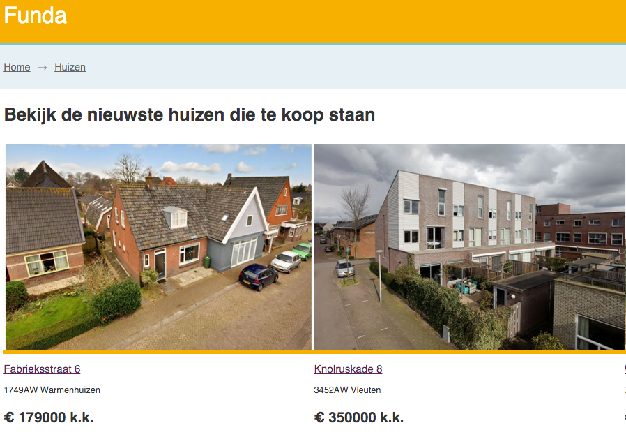
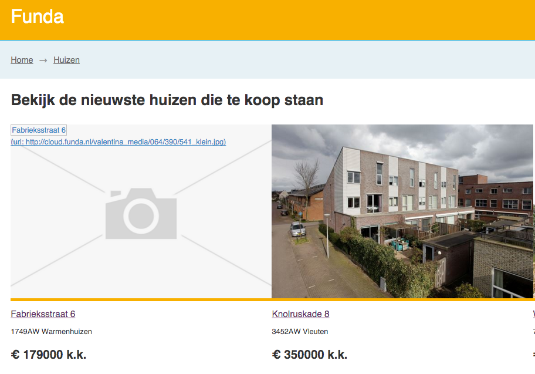

## Feature: Afbeeldingen

### Waarom fallbacks voor afbeeldingen?

**Probleem:** Niet elke browser toont elke afbeelding op je website. Dit kan komen door:

- Browsers met image blockers (Of Save-Data HTTP header)
- Plugins die afbeeldingen blokkeren
- Afbeeldingen die niet laden (CDN down of onbereikbaar)
- Blinden die sowieso geen afbeeldingen kunnen zien

### Verantwoordelijkheid

Het is onze verantwoordelijkheid om hier door middel van progressive enhancement oplossingen voor te verzinnen, want niemand anders gaat dit voor je oplossen en je wilt natuurlijk niemand uitsluiten als bezoeker op je website.

### Fallback

In de Funda app staan afbeeldingen centraal en is de grootste core feature. Je kunt afbeeldingen stuk laten gaan en er niks aan veranderen waardoor de gebruiker geen idee heeft wat er mis gaat en krijgt geen content te zien. Als alternatief voor dit probleem heb ik de afbeeldingen een fallback plaatje gegeven, waar je de afbeelding ziet van een camera. Dit dient als placeholder, zodat de gebruiker weet dat hier eigenlijk een plaatje hoort te staan. Als extra optie heb ik de afbeelding nog een psuedo class :after gegeven waarin de oorspronkelijke url vandaan komt. De bezoeker kan dan kijken of de url echt niet bestaat.

#### Without fallback


#### With fallback


### Code


#### HTML

```
<a href="#huis/{{ id }}">
    <figure class="fallback">
    	
    </figure>
</a>		
```
#### CSS

```
/* Fallback images */

.fallback {
    /* this URL here is theoretically a local one (always reachable) */
    background-image: url("../images/missing.png");
    width: 100%;
    background-position: center center;
    background-size: cover;
    background-repeat: no-repeat;
    margin: 0;
}
.image:after {
    content: "(url: " attr(src) ")";
    display: block;
    font-size: 1em;
}

```


